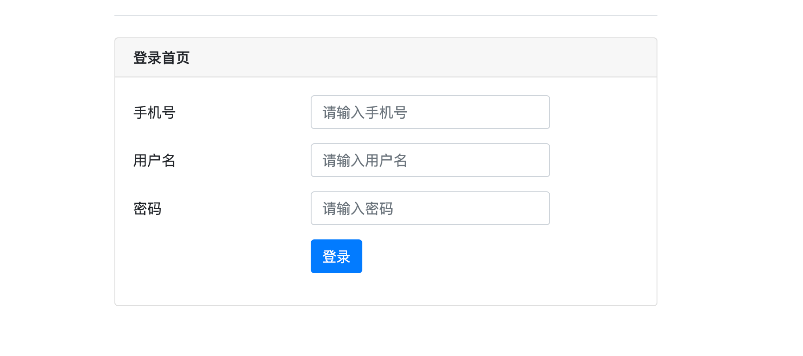
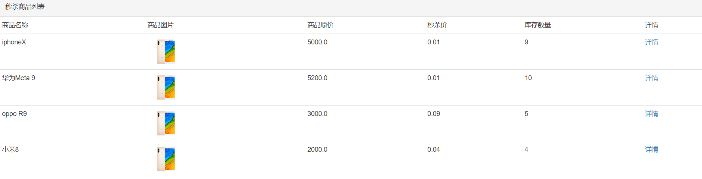
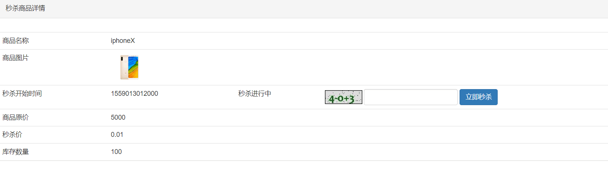
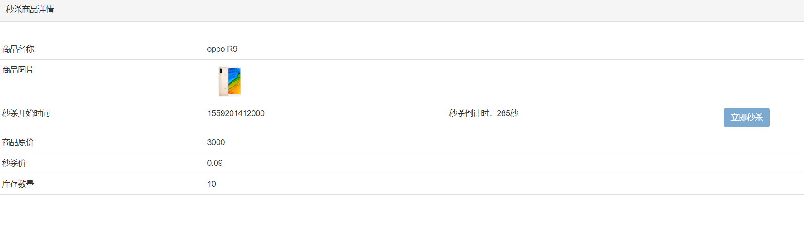
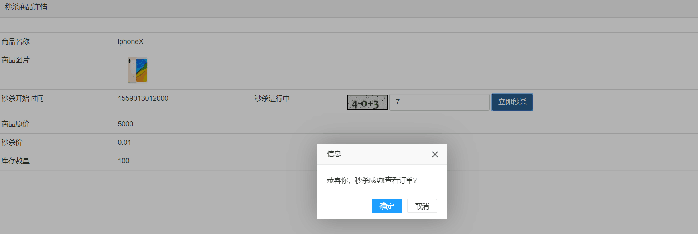

# 基于 SpringBoot + Maven + Mybatis + Redis + RabbitMQ 高并发商城秒杀系统

该项目实现了一个高并发的秒杀系统，利用 **SpringBoot、Maven、Mybatis、Redis、RabbitMQ** 等技术栈，解决了高并发秒杀场景中的常见问题，如缓存优化、流量削峰、异步处理等。该系统能够在大量并发请求下，确保秒杀活动的稳定性和高效性。

### 项目特点：
- **高并发秒杀处理**：采用多线程异步处理和缓存技术。
- **分布式架构支持**：支持横向扩展，分布式部署。
- **异步下单与消息队列**：使用 RabbitMQ 完成订单异步处理。
- **安全性优化**：双重 MD5 加密、验证码校验、限流防刷。
- **缓存优化**：利用 Redis 缓存秒杀商品和用户信息，减少数据库负担。
- **页面静态化**：缓存秒杀页面到浏览器，减少服务器压力。

## 技术架构图


## 运行环境

| JDK  | Maven | MySQL | SpringBoot     | Redis | RabbitMQ |
|------|-------|-------|----------------|-------|----------|
| 1.8  | 3.9.6 | 8     | 2.3.12.RELEASE | 3.2   | 3.7.14   |

## 使用说明

### 1. 克隆项目：
```bash
git clone https://github.com/pitt1997/seckill
```

### 2. 配置数据库：
-   安装启动 MySQL 数据库。
-   运行 `sql` 文件夹中的 readme SQL 脚本，初始化数据库和表数据。
-   修改 `src/main/resources/application.properties` 中的数据库连接、Redis 配置和 RabbitMQ 配置。

### 3. 配置依赖服务：

-   需要提前安装并启动 Redis 和 RabbitMQ 服务，确保项目能正确连接。

### 4. 启动项目：

-   导入项目到 **IntelliJ IDEA** 中。

-   运行 `SeckillApplication.java` 启动 SpringBoot 项目。

-   访问秒杀系统：

    -   登录地址：<http://localhost:8080/login/index>
    -   商品秒杀列表：<http://localhost:8080/goods/list>

### 5. 测试数据：

-   数据库中已提供1000个用户（手机号：15200000000~15200000997，密码为：123456）。
-   使用 `com.lijs.seckill.util.UserUtil` 可继续生成用户数据并进行压测。

### 6. 调整秒杀时间：

-   在数据库中调整秒杀商品的时间范围，确保秒杀活动按时启动。

## 压力测试与性能结果

### 测试环境：

-   **JDK**: 1.8
-   **Maven**: 3.9.6
-   **MySQL**: 8
-   **Redis**: 3.2
-   **RabbitMQ**: 3.7.14
-   **测试工具**: JMeter

### 测试用例：

-   **用户数量**: 1000
-   **请求并发量**: 5000
-   **测试时间**: 10分钟
-   **请求类型**: 秒杀请求

### 测试结果：

-   **QPS（每秒处理请求数）** : 1500
-   **平均响应时间**: 150ms
-   **成功请求率**: 99.8%
-   **失败请求率**: 0.2%

### 性能瓶颈分析：

-   数据库查询响应时间较长，建议进一步优化查询语句。
-   Redis 缓存命中率较高，提升了系统的并发处理能力。
-   消息队列成功削峰，避免了系统宕机。

### 解决方案：

-   增强数据库性能，使用分布式数据库。
-   优化消息队列的消费者处理速度。

## 系统功能

### 1. 用户模块

-   **用户注册与登录**：支持手机号登录，采用双重 MD5 加密密码。
-   **验证码验证**：秒杀接口有验证码限制，防止恶意攻击。

### 2. 秒杀模块

-   **商品秒杀**：展示秒杀商品，提供秒杀按钮，用户可以在规定时间内参与秒杀。
-   **秒杀倒计时**：展示秒杀商品的剩余时间。
-   **秒杀结果展示**：秒杀成功或失败后的结果展示页面。

### 3. 管理员模块

-   **秒杀商品管理**：管理员可以增加、修改商品秒杀时间，设置秒杀库存。
-   **用户管理**：管理员可以查看所有用户的秒杀记录。

## 示例页面截图

### 登录页面



### 商品列表页面



### 商品详情页面



### 秒杀倒计时页面



### 成功秒杀页面



## 更多资源与学习资料
- [个人博客](https://blog.csdn.net/brad_pitt7)
- [项目文档与教程](https://blog.csdn.net/brad_pitt7)

* * *

---